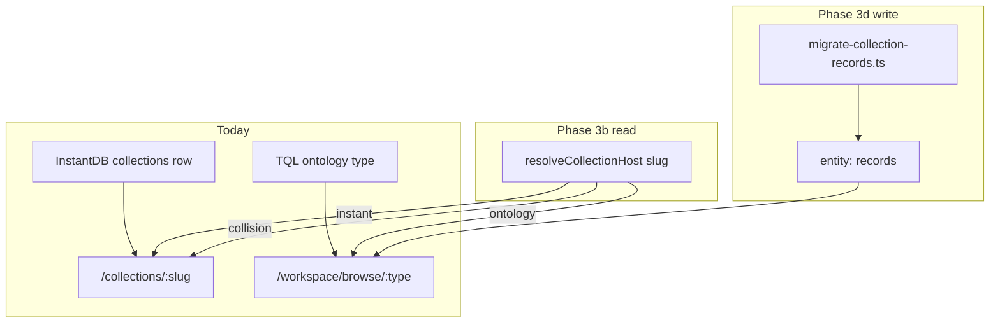

# Spec: Browse Convergence Phase 3 — InstantDB collections → graph (C1)

**VCS:** browse-convergence/phase-3 (no TRL filed in trellis-client)  
**Parent:** browse-convergence/phases-0-2 (shipped)  
**Strategist decision:** A → C (ship 0–2, then C1 collections epic)  
**ADR context:** `docs/architecture/adr-002-graph-derived-client-realtime-convergence.md` D6/D7 · `AGENTS.md` § Entity types vs collections vs browse  
**Related (orthogonal):** `.agent/plans/WU-ADR002-browse-live-spec.md` (TRL-17 entity read live) · `docs/artifacts/view_projections_design.md` (TRL-26 projection outlet)

---

## Problem

Phases 0–2 unified **ontology browse** (TQL types, capability flags, `/types` deprecation). Three **distinct** “collection” concepts remain:

| Concept | Store | URL | Records |
|---------|-------|-----|---------|
| **InstantDB platform collection** | `instant-local` / InstantDB `collections` + `settings` | `/collections/:slug` | JSON-LD `trellis:Record` in `content` |
| **TQL ontology browse** | Kernel SQLite | `/workspace/browse/:type` | `entity:` nodes with `data.type` |
| **Graph container `collection`** | Kernel | `/workspace/browse/collection` | Container entity + `children[]` |

Plus **`platform:collection/*`** API namespace (CLI/platform routes) — fourth collision surface.

Today: slug dispatch at [`collections/[slug].vue`](../../apps/web/app/pages/collections/[slug].vue) redirects to browse when no InstantDB row exists. **InstantDB wins** on collision ([`collections-browse-dispatch.ts`](../../apps/web/app/lib/collections-browse-dispatch.ts)). Sidebar can still show duplicate entries for the same slug.

**Studio target:** collections = **browsable type scopes on the graph** — spreadsheet UX is a **projection** over ontology records, not a parallel datastore.

---

## Goal (Phase 3 epic)

Converge InstantDB spreadsheet collections onto the graph **without breaking** existing `/collections/:slug` URLs or projection UX until cutover.

### End state

1. User creates a “database” → creates **user-tier ontology** + optional graph metadata (not InstantDB-only schema).
2. `/collections/:slug` resolves via **host resolver** → graph-backed records when migrated; InstantDB fallback until cutover.
3. Single slug namespace with explicit collision policy (documented + visible in UI).
4. Record CRUD flows through `useTrellisEntities` / graph mutate (InstantDB `content` JSON-LD retired per collection).

### Non-goals (Phase 3)

- Chat `entityKind` vs `type` normalization (separate epic C2)
- ADR-002 P3 app-config live query (TRL-15 scope — do not bundle)
- Sidecar / Option B transport (`.agent/plans/WU-OPTION-B-001.md` Phase 2)
- Full `ProjectionOutlet` unification (TRL-26 — parallel track, not blocking 3b)
- Kanban/calendar **body** parity per migrated collection (use browse projections first)

---

## Architecture

### Collision policy (locked)

| Condition | Host | Path |
|-----------|------|------|
| InstantDB collection exists for slug | **Spreadsheet** (InstantDB) | `/collections/:slug` |
| No InstantDB row + browsable ontology | **Browse** | `/workspace/browse/:slug` |
| Both exist | **InstantDB wins** (browse hidden in sidebar; dev `console.warn`) |
| Neither | 404 / empty state | — |

---

## Phased slices (executor order)

### Slice 3b-1 — Unified host resolver (read path) **← first impl**

**Goal:** One pure function + composable; replace ad-hoc watchers.

| File | Action |
|------|--------|
| `apps/web/app/lib/collection-host-resolver.ts` | **New** — `resolveCollectionHost({ slug, hasInstantDbCollection, isBrowsableOntologyType, hasInstantDbAndOntology })` → `{ kind: 'instant-collection' \| 'ontology-browse' \| 'not-found', path, collision }` |
| `apps/web/app/lib/collection-host-resolver.test.ts` | **New** — extend dispatch tests + collision flag |
| `apps/web/app/lib/collections-browse-dispatch.ts` | **Deprecate** — re-export from resolver or thin wrapper |
| `apps/web/app/pages/collections/[slug].vue` | Use resolver; log collision when `collision: true` |
| `apps/web/app/composables/useCollectionHost.ts` | **New** — wraps InstantDB + ontology registry for pages/sidebar |
| `apps/web/app/composables/useRoutes.ts` | Sidebar dedup: omit ontology child when InstantDB owns slug |
| `AGENTS.md` | Document resolver + collision UX |

**Acceptance criteria:**

- [ ] `pnpm exec vitest run app/lib/collection-host-resolver.test.ts` passes
- [ ] `/collections/:slug` behavior unchanged for InstantDB-only and ontology-only slugs
- [ ] When both exist: stays on collections page; sidebar shows InstantDB entry only
- [ ] `pnpm check` static (no new lint errors on touched files)

---

### Slice 3b-2 — Schema shadow read (optional bridge)

**Goal:** Map `DatabaseSchema.fields` → temporary ontology field preview for projection gating (read-only).

| File | Action |
|------|--------|
| `apps/web/app/lib/collection-schema-to-ontology.ts` | **New** — `databaseFieldToOntologyField()` mapper |
| `apps/web/app/pages/collections/[slug].vue` | Use mapper for `suggestCollectionViews` when no graph ontology |

**AC:** Kanban/calendar suggestions work from InstantDB schema without graph ontology row.

---

### Slice 3c — Collection → ontology provisioning

**Goal:** New spreadsheet creates user-tier ontology alongside InstantDB row (dual-write provisioning).

| File | Action |
|------|--------|
| `apps/web/app/components/dialogs/CollectionCreateDialog.vue` | After InstantDB create, POST ontology if slug valid + not reserved |
| `apps/web/app/composables/useInstantData.ts` | `createCollection` hook → ontology provision |
| `apps/web/scripts/migrate-custom-types-to-ontologies.ts` | Pattern reference |

**AC:** Creating collection `recipes` creates `trellis:schema/recipes` user ontology with mapped fields.

---

### Slice 3d — Record ETL + cutover

**Goal:** One-time migration per collection; graph becomes source of truth.

| File | Action |
|------|--------|
| `apps/web/scripts/migrate-collection-records-to-graph.ts` | **New** — read JSON-LD records → `createNode` entities; manifest with id map |
| `apps/web/app/lib/instantDataMigrations.ts` | Register migration version flag per collection |
| `apps/web/app/pages/collections/[slug].vue` | When `collection.migratedToGraph`, read via `useBrowsePage` not JSON-LD |

**AC:**

- [ ] `--dry-run` prints record count + slug manifest
- [ ] Migrated collection: edits persist to graph; InstantDB `content` read-only
- [ ] Rollback documented (manifest reverse map)

---

## Risks

1. **Four namespace meanings** — resolver must not conflate graph container `collection` type with platform spreadsheet.
2. **Record ID stability** — `trellis:record/uuid` → `entity:slug` mapping required in ETL manifest.
3. **Monolithic `collections/[slug].vue`** — slice 3b-1 should not refactor host; 3d may extract `useCollectionPage`.
4. **TRL-17 dependency** — migrated collections benefit from live browse; fallback TQL OK for v1.

---

## Verification (epic)

| Tier | Command |
|------|---------|
| Unit | `vitest run app/lib/collection-host-resolver.test.ts app/lib/collections-browse-dispatch.test.ts` |
| Static | `pnpm check` (scoped) |
| Manual | Create colliding slug → InstantDB wins; sidebar dedup; ontology-only redirect |
| E2e (follow-up) | `tests/e2e/collections-host-resolver.spec.ts` (needs-e2e label) |

---

## Handoff

**Start with Slice 3b-1** — smallest read-path wedge; no designer required; builds directly on Phases 0–2 dispatch logic.

Projection unification (TRL-26) may proceed in parallel — do not block 3b-1.
