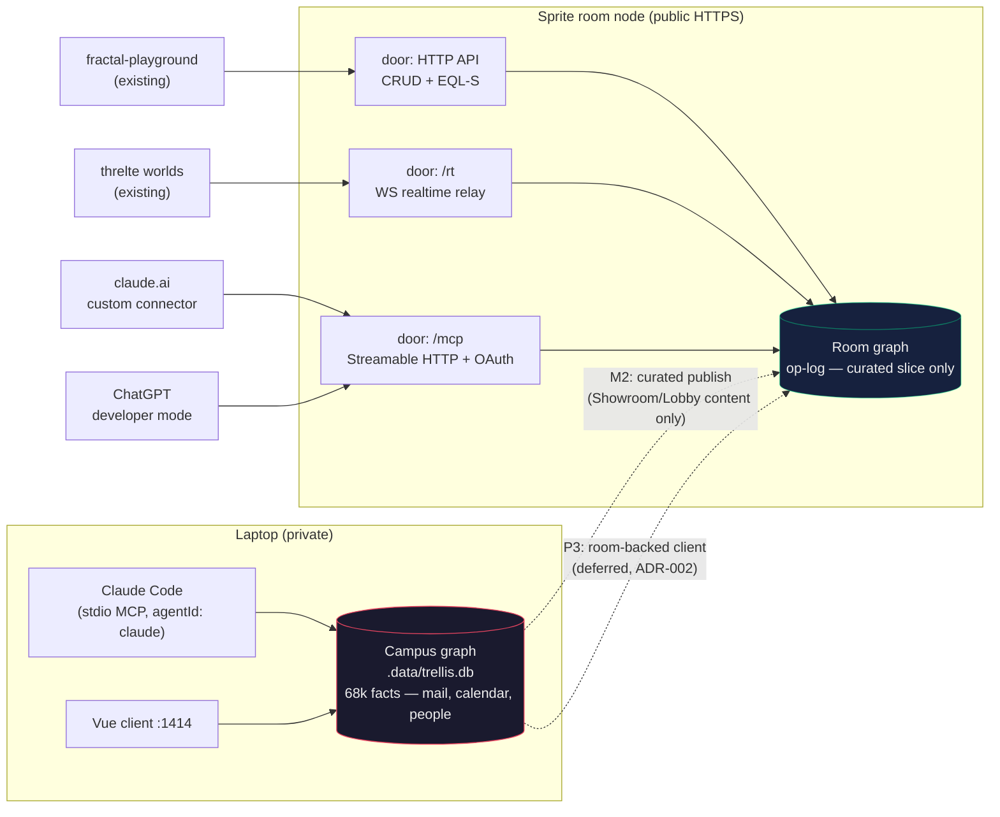
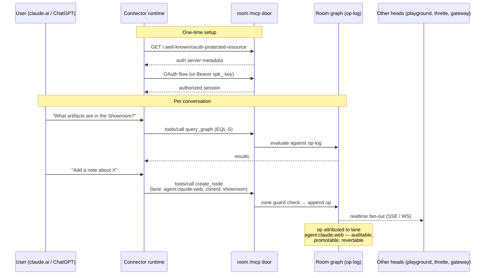
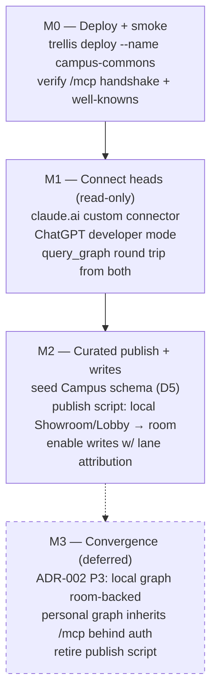

# WU-REMOTE-MCP-000: Expose the Trellis graph to Claude web & ChatGPT (proposal)

**Status:** **Ship-ready (Path A)** — M0 ✅ · M1 claude.ai ✅ (summary + get_node + query_graph; room EQL dialect documented) · M1 ChatGPT optional (user-click) · M2 ✅ (seed, publish script, greeter, F1/F2 redeploy) · F3 OAuth DCR deferred.
**Pipeline queue (2026-07-04):** A ship WU-REMOTE-MCP → B TRL-10 spec (Studio) → C VCS kanban proposal → D TRL-12 review pass.
**Date:** 2026-07-04

> **M0 results (2026-07-04):** room live at `https://campus-commons-bnsoz.sprites.app`.
> **Path correction:** Sprites reserves `/mcp` — the door is **`/trellis/mcp`** on `*.sprites.app` (gateway at `/gateway/mcp`). `.trellis-db.json` written to trellis-client root (gitignored before deploy).
> Handshake ✅ (trellis-room v0.2.0, protocol 2025-03-26) · `graph_health` tool call ✅ · both OAuth well-knowns 200 ✅ · CORS already allows `X-Trellis-Lane` ✅
>
> **Findings:**
> - **F1 ✅ (fixed 2026-07-04, trellis-node):** MCP write tools now call `assertMcpWriteAuthorized` when `apiKey` is configured — anonymous `graph_health` / `query_graph` / `get_node` still work; `create_node`, `update_node`, `delete_node`, `link_nodes`, `create_collection_record` require `Authorization: Bearer spk_…` or JWT. Verified live on campus-commons after rebuild + redeploy.
> - **F2 ✅ (fixed 2026-07-04):** OAuth metadata now uses `requestPublicOrigin()` with Sprites `*.sprites.app` → `https` inference; `mcp_resource` points at `/trellis/mcp` on Sprites hosts.
> - **F3 (open):** `registration_endpoint` still points at `/auth/register` (user signup), not RFC 7591 dynamic client registration — OAuth-mode claude.ai connectors may still fail; bearer header auth works today.
> - **M1 connector note:** claude.ai can stay no-auth for read-only browsing (public slice only). Writes from web heads need bearer in connector config once their UI supports it, or use the stdio bridge with `--api-key`.
**Builds on:** ADR-002 (D1 room-node convergence, D3 zone=room, D8 agent attribution), CAMPUS.md (zones as visibility scopes)
**Verified preconditions:** local stdio MCP working (2026-07-04, this repo, `agentId: claude`); trellis-node rooms serve `/mcp` (Streamable HTTP) with `spk_` bearer keys, Google OAuth JWT, and OAuth discovery well-knowns; `trellis deploy --name <n>` deploys a room to Sprites and writes `.trellis-db.json` (url + apiKey).

---

## 1. Goal

Make a Trellis graph reachable from **claude.ai (custom connector)** and **ChatGPT (developer-mode connector)** — remote heads walking through the `/mcp` door of a deployed room node.

**Non-goals (explicitly rejected or deferred):**

- **No tunnel to the local campus graph** (rejected "Path 2"). The local graph API trusts localhost and contains mail/calendar/finance; a tunnel makes localhost the internet. Revisit only after ADR-002 P3, when the local graph is room-backed and auth-fronted by construction.
- **No general local↔room sync.** That is ADR-002 P3 (kernel swap / room-backed client). This WU ships a *curated publish* flow only (M2).
- **No new server code expected.** Every mechanism exists in trellis-node; this WU is deployment, configuration, policy, and a small publish script.

## 2. Topology

One room node, one op-log, three doors — remote heads pick their door. The
local campus graph stays private; a curated publish flow (M2) is its only
bridge to the room until P3 convergence.

## 3. Connector flow

What happens when a claude.ai user (or ChatGPT) talks to the room:

Core tools available through the room door (per trellis-node): `get_graph_summary`, `query_graph`, `get_node`, `create_node`, `update_node`, `delete_node`, `link_nodes`, `graph_health`. Platform tools (orgs/tags/pages/workflows) remain local-only.

## 4. Decisions requiring sign-off

| # | Decision | Recommendation | Rationale |
|---|----------|----------------|-----------|
| D1 | Dedicated room vs reuse existing sprite | **Dedicated room** (working name: `campus-commons`) | Blast radius: connector keys, experiments, and demo data stay isolated from playground/threlte rooms; key rotation doesn't break other heads |
| D2 | Auth mode per client | **claude.ai → OAuth** (well-knowns exist for exactly this); **ChatGPT → OAuth**, bearer only if its connector UI fights us | Never unauthenticated while write tools are exposed |
| D3 | Data policy — what lives in the room | **Curated public slice only**: artifacts, published pages/notes, public project info. **Never** mail, calendar, finance, contacts | The room is the Showroom/Lobby made literal (CAMPUS.md); publicRead zones only. Personal graph stays on the laptop until P3 |
| D4 | Write policy | **M1 read-only** (connector approval defaults deny writes); **M2 enables writes** with mandatory lane attribution (`agent:claude-web`, `agent:chatgpt`) and zone stamping | Matches ADR-002 D8: agent output earns residence, attributed and auditable |
| D5 | Seed shape | **Seed the Campus schema into the room** (facility + lobby/showroom zones) before content | Zone guard doctrine applies remotely; queries and grants use the same vocabulary as the local graph, so M2 publish is a copy, not a translation |

## 5. Milestones

### M0 — Deploy + smoke (½ day)

- `trellis deploy --name campus-commons` from trellis-node; capture `.trellis-db.json` (gitignored; key never committed).
- **AC:** MCP `initialize` handshake succeeds against `https://<room>.sprites.app/mcp` with bearer key; `/.well-known/oauth-protected-resource` and `/.well-known/oauth-authorization-server` return valid metadata; `graph_health` returns ok. Use `trellis mcp` smoke tooling / `npx trellis mcp bridge --room <url>` for verification — not raw curl against graph routes.

### M1 — Connect both heads, read-only (½–1 day)

- claude.ai: Settings → Connectors → add custom connector (room `/mcp` URL, OAuth).
- ChatGPT: Settings → Connectors → Developer mode → add server.
- **AC:** from *both* clients: `get_graph_summary` returns room stats; an EQL-S `query_graph` returns seeded entities; write tools either absent or denied by connector policy. Setup steps documented in `docs/getting-started/remote-mcp.md`.

### M2 — Curated publish + attributed writes (1–2 days)

- Seed Campus schema into the room (facility, lobby + showroom zones, `publicRead` flags).
- Publish script (zx or trellis CLI): select local entities where `zoneId ∈ {showroom, lobby}` → create in room with provenance (`sourceId`, `derivedFrom`). Idempotent; re-runnable.
- Enable write tools; every remote write carries `lane: agent:<client>` + explicit `zoneId`.
- **AC:** a note created from claude.ai lands in the room's Showroom with lane attribution visible in the room op-log; publish script run twice produces no duplicates; nothing outside showroom/lobby zones ever appears in the room (spot-check query).

### M3 — deferred; tracked by ADR-002 P3, not this WU.

## 6. Security posture

- **Data minimization is the primary control** (D3). The room contains nothing whose leak would hurt — auth failures degrade to "someone read public-ish content."
- Bearer key lives in `.trellis-db.json` (gitignored) and the connector configs only. Rotation: redeploy key via `trellis deploy` options; update two connectors.
- `TRELLIS_MCP_GRAPH_IO_LIMIT` set to a sane daily cap (abuse control).
- All remote writes lane-attributed → auditable in the room op-log; bad writes are revertable ops, not silent corruption (append-only).
- Standing rule from ADR-002 D4 applies: server-side filtering is an optimization, not a trust root — which is *why* private data stays out of the room entirely rather than relying on per-query filtering.

## 7. Risks

| Risk | Likelihood | Mitigation |
|------|-----------|------------|
| ChatGPT connector UX friction (dev-mode gating, OAuth quirks) | Medium | Bearer fallback; worst case ChatGPT ships in read-only until its connector matures |
| Room/local schema drift (ontology changes locally, room seeded once) | Medium | Publish script re-asserts schema on every run (idempotent ontology upsert) |
| Scope creep toward "sync everything" | High (it's tempting) | M3 is explicitly deferred to P3; publish script refuses entities outside allowed zones |
| Sprite cold-start latency on first connector call | Low | Acceptable for M1/M2; revisit keep-warm only if it annoys in practice |

## 8. Open questions (non-blocking)

1. Does the room's OAuth authorization server support claude.ai's dynamic client registration out of the box, or does it need a registered client? (Surfaces in M1; bearer is the fallback while resolving.)
2. Should the ChatGPT lane be `agent:chatgpt` or per-user (`agent:chatgpt:`)? Start coarse; refine when a second human uses the connector.
3. Gateway (`trellis mcp gateway serve`) as a future single endpoint for *multiple* rooms — out of scope here, but M0 naming should not collide with a future gateway deployment.
