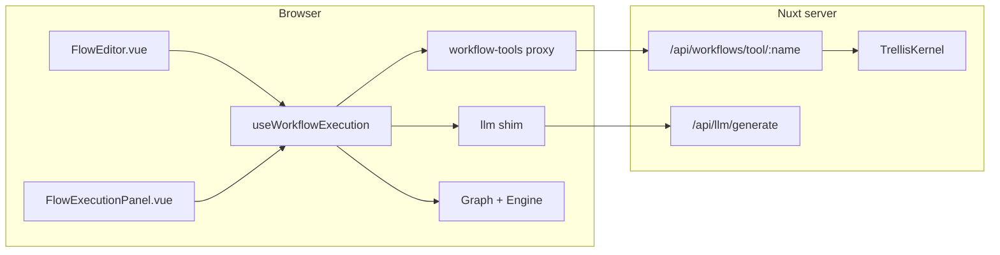

# ADR-002 — Agent graph engine audit (embedded `graph/` vs npm)

**Date:** 2026-07-03  
**VCS:** TRL-21 · parent TRL-12 (ADR-002 epic)  
**Compared:** `@turtle.tech/trellis-kernel/graph` (monorepo embedded) vs `trellis@3.2.3` (`trellis/ai`, `trellis/core/agents`)  
**Parent audit:** `docs/architecture/adr-002-kernel-fork-file-audit.md` § port queue #3  
**Builds on:** TRL-18 · TRL-19a · TRL-20

---

## Executive summary

**Verdict: keep embedded** `packages/trellis-kernel/graph/` through ADR-002 P1.

The Flow workflow builder compiles Vue Flow node graphs into a **client-side DAG executor** (`Graph` + `Engine`) with seven node kinds, step traces, and browser-safe LLM/tool proxies. Published npm `trellis@3.2.3` has **no equivalent export**. The `trellis/ai` subpath is embeddings/RAG only — it is **not** a workflow engine despite the name collision. `trellis/core/agents/AgentHarness` manages graph-resident agent definitions and decision traces on the server; it does not execute visual DAGs and cannot replace `useWorkflowExecution`.

Do not port or delete `graph/` during TRL-19b kernel swap. Three app files type directly against embedded interfaces; Flow UI components consume those types. Optional future work: upstream `graph/` to published `trellis` (TRL-22 preview) or bridge `AgentHarness` for zone agents (TRL-23 preview).

---

## Problem

TRL-18 assigned **keep embedded** to `graph/` from file inventory alone. Without a focused comparison, engineers ask whether `trellis/ai` or npm agent APIs replace the embedded engine. That risks accidental deletion during kernel convergence or wasted port effort on non-equivalent surfaces.

This audit supplies:

1. File inventory for all 10 `graph/*.ts` modules
2. npm capability comparison (`Engine` vs `AgentHarness` vs `trellis/ai`)
3. App integration map (composables, adapters, Flow UI)
4. Binding decision with rationale

---

## Embedded graph inventory

All files under `packages/trellis-kernel/graph/` (1,511 LOC total; 988 LOC excluding logger pair):

| File | LOC | Role | TRL-18 verdict |
|------|-----|------|----------------|
| `index.ts` | 10 | Barrel — exports types, graph, engine, executors, util | keep embedded |
| `graph.ts` | 38 | `Graph` container (addNode, addEdge, lookup) | keep embedded |
| `engine.ts` | 378 | `Engine` — async generator `run()`, step budget, orchestrator hooks | keep embedded |
| `executors.ts` | 156 | Default executors per `NodeKind` | keep embedded |
| `tools.ts` | 217 | Tool registry helpers (Node-only; not re-exported from barrel — uses `node:vm`) | keep embedded |
| `types.ts` | 157 | `NodeKind`, `EngineState`, `Trace`, `LLMClient`, `ToolFn`, `Orchestrator` | keep embedded |
| `validators.ts` | 22 | Graph structure validation | keep embedded |
| `util.ts` | 10 | Small helpers | keep embedded |
| `logger.ts` | 507 | Structured graph logger | **drop** — unused by app |
| `logger-index.ts` | 16 | Logger factory | **drop** — unused by app |

**Runtime-critical subset:** 8 files (988 LOC excluding logger). The barrel intentionally omits `tools.ts` because it uses top-level `await import('node:vm')` and cannot be Vite-bundled for the browser.

### Node kinds (`types.ts`)

| `NodeKind` | Purpose |
|------------|---------|
| `Agent` | LLM call with system/prompt/model; optional streaming |
| `Tool` | Invoke named tool from `Record<string, ToolFn>` |
| `Router` | Conditional edge selection via `when` predicates |
| `Guard` | Allow/block gate on engine state |
| `MemoryRead` | Read from in-memory KV or Trellis graph (via TQL tools) |
| `MemoryWrite` | Write to in-memory KV or graph entity (create/update) |
| `End` | Terminal node |

---

## npm comparison

Resolved version: **`trellis@3.2.3`** (`apps/web/node_modules/trellis`).

### What `trellis/ai` is not

The `./ai` export maps to `dist/embeddings/` — `EmbeddingManager`, chunkers, vector store, RAG context builders. It provides semantic search over graph entities, not DAG execution. **Do not use `trellis/ai` for Flow workflows.**

### Capability matrix

| Capability | Embedded `Engine` | `AgentHarness` (`trellis/core/agents`) | `trellis/ai` |
|------------|-------------------|----------------------------------------|--------------|
| Visual DAG nodes (7 kinds) | Yes | No | No |
| Client/browser execution | Yes (`globalThis.crypto` for run IDs) | No — requires `TrellisKernel` | No |
| Step traces | `Trace[]` (per-node timing, errors) | `DecisionTrace[]` (tool decisions) | — |
| LLM integration | Injectable `LLMClient` | `LLMProvider` via harness config | Embedder only |
| Tool invocation | `Record<string, ToolFn>` at construct time | `registerTool` + `invokeTool` per run | — |
| Graph memory R/W nodes | `MemoryRead` / `MemoryWrite` with graph mode | `ContextManager` (different contract) | Vector store search |
| Orchestrator hooks | `beforeNode`, `afterNode`, `onError`, `beforeEdgeSelect`, … | — | — |
| Streaming LLM | `LLMClient.stream?` optional | Provider-dependent | — |
| Graph entity CRUD from workflow | Custom executors via `tql_mutate` tool proxy | Kernel mutate via harness | — |
| Agent definition storage | Workflow JSON in platform DB | `AgentDef` entities on kernel | — |

**Conclusion:** No npm drop-in. `AgentHarness` is **complementary** — suitable for zone agents, MCP-style autonomous runs, and decision-trace recording — not a replacement for the visual Flow DAG executor.

### npm export map (relevant subpaths)

| Subpath | Exports | Workflow DAG? |
|---------|---------|---------------|
| `trellis/ai` | `EmbeddingManager`, chunkers, RAG | **No** |
| `trellis/core/agents` | `AgentHarness`, `AgentDef`, `ToolDef`, `DecisionTrace` | **No** |
| `trellis/core` | `TrellisKernel`, persistence, EQL | Kernel only |
| `trellis/plugins/*` | Plan approval, proactive watcher, etc. | Different contract |

---

## App integration map

### Direct `@turtle.tech/trellis-kernel/graph` importers

| Importer | Path | Imports |
|----------|------|---------|
| Workflow compiler + runner | `apps/web/app/composables/useWorkflowExecution.ts` | `Graph`, `Engine`, `Node`, `EngineEvent`, `EngineState`, `Trace`, `LLMClient`, `ToolFn`, `Executor`, `ExecutorTable`, `ExecResult`; re-exports `Trace` |
| Tool proxy client | `apps/web/app/lib/workflow-tools/index.ts` | `ToolFn` |
| LLM shim | `apps/web/app/lib/llm/index.ts` | `LLMClient` |
| Deprecated shim | `packages/tql/graph.ts` | `export * from '@turtle.tech/trellis-kernel/graph'` |

### UI coupling (indirect)

| Consumer | Path | Dependency |
|----------|------|------------|
| Run history | `apps/web/app/composables/useWorkflowRuns.ts` | Imports `Trace` type from `useWorkflowExecution`; persists runs to platform storage |
| Flow editor | `apps/web/app/components/Flow/FlowEditor.vue` | Imports `NodeExecutionState` type; uses `useWorkflowEditor` for graph persistence |
| Execution panel | `apps/web/app/components/Flow/FlowExecutionPanel.vue` | Imports `Trace`, `ExecutionStatus`, `StepOutput`, `NodeExecutionState` types |
| Workflow editor state | `apps/web/app/composables/useWorkflowEditor.ts` | Node `kind` defs map to Flow node components (feeds `useWorkflowExecution` compiler) |

### Execution architecture



Client-side `Engine.run()` yields step traces; secrets and kernel access stay server-side via HTTP proxies.

### UI `kind` → `NodeKind` mapping (`useWorkflowExecution`)

| Flow UI `kind` | Compiled `NodeKind` | Notes |
|----------------|---------------------|-------|
| `start` | `Agent` (passthrough) | Start node compiles to passthrough Agent with `{{input}}` |
| `agent` | `Agent` | system, prompt, model, stream |
| `tool` | `Tool` | name + args → server tool proxy |
| `router` | `Router` | JS condition strings compiled to `when` predicates |
| `guard` | `Guard` | allow/block mode + condition |
| `memory-read` | `MemoryRead` | `source: state \| graph` |
| `memory-write` | `MemoryWrite` | graph mode uses `tql_load_data` / `tql_mutate` |
| `end` | `End` | Terminal |
| `note` | — | Skipped at compile (annotation only) |

Custom graph-memory executors override defaults for `MemoryRead` / `MemoryWrite` when `source === 'graph'`, wiring TQL tools (`tql_query`, `tql_load_data`, `tql_mutate`) registered in `createDefaultWorkflowTools()`.

---

## Sibling module: `workflows/` (not `graph/`)

`packages/trellis-kernel/workflows/WorkflowEngine` executes **YAML dataset pipelines** (parser → planner → runners → cache). It is reached from:

- `packages/trellis-kernel/cli/tql.ts` (`workflow run` subcommand)
- Nuxt `/api/workflows/run` and trigger routes (bundled via `packages/trellis-cli/web`, not direct import from `apps/web/server`)

The Flow editor does **not** use `WorkflowEngine`. Do not conflate YAML pipeline execution with the visual DAG `Engine`. Verdict per TRL-18: **keep embedded** for `workflows/` as well.

---

## Verdict and rationale

### Primary verdict

**Keep embedded** `packages/trellis-kernel/graph/` through ADR-002 P1. No import path changes in TRL-21.

### Rationale

**No npm API parity.** `trellis@3.2.3` exports neither `Graph`, `Engine`, `NodeKind`, nor `ExecutorTable`. The seven node kinds, orchestrator hooks, and async-generator `run()` loop are fork-specific. Porting would require either publishing a new npm subpath (TRL-22) or rewriting `useWorkflowExecution` against a different abstraction — both are out of scope for kernel swap.

**Browser-first execution model.** The embedded engine runs in the browser with `globalThis.crypto` for run IDs and proxies LLM/tools to Nuxt routes. `AgentHarness` requires a server-side `TrellisKernel` instance, loads agent defs from the graph, and records `DecisionTrace` entities — a different paradigm for zone agents, not visual workflow stepping. The two systems can coexist; neither subsumes the other.

**App type coupling.** Three production files import embedded graph types (`LLMClient`, `ToolFn`, `Engine`, `Trace`). Flow components (`FlowEditor`, `FlowExecutionPanel`) consume composable types derived from those interfaces. Swapping to npm before upstream publishes an identical contract would break the Flow builder without a full rewrite.

**Kernel swap isolation.** TRL-19a stabilized persistence toward npm schema; TRL-19b will swap `TrellisKernel` imports. Touching `graph/` in parallel risks dual-engine drift. This audit closes the question so TRL-19b can proceed without touching workflow execution.

**`trellis/ai` is not a workflow engine.** The `./ai` subpath is embeddings and RAG. Any product question of “why not trellis/ai for workflows?” is answered by export map inspection — there is no DAG executor in that package.

---

## Follow-on wedges (preview only)

| ID | Title | Trigger | Status |
|----|-------|---------|--------|
| TRL-22 | Upstream `graph/` to published `trellis` | Product wants single npm engine for Studio + CLI | Not queued |
| TRL-23 | `AgentHarness` bridge for zone agents | `/agent` lab UI adopts harness for autonomous runs | Not queued |
| TRL-24 | Retire `packages/tql/graph.ts` shim | After any graph port or when external `@tql` consumers gone | Not queued |
| TRL-19b | Full kernel + EQL-S swap | Post TRL-19a persistence | Deferred |

---

## Appendix — verification commands

```bash
# Section headers (expect ≥7)
rg -n "^## " docs/architecture/adr-002-agent-graph-engine-audit.md

# Graph file count (expect 10)
find packages/trellis-kernel/graph -name '*.ts' | wc -l

# Direct importers (expect 3 apps/web + 1 tql shim)
rg -l '@turtle.tech/trellis-kernel/graph' apps/web packages/tql --glob '*.{ts,vue}'

# npm resolved version
node -e "console.log(require('./apps/web/node_modules/trellis/package.json').version)"

# Docs-only diff
git diff --stat -- docs/
```

**TRL-21 AC summary:** artifact ≥120 lines · 10/10 graph files · 9-row npm matrix · 4 importers documented · 7 node kinds + UI mapping · **keep embedded** verdict · docs-only diff.
