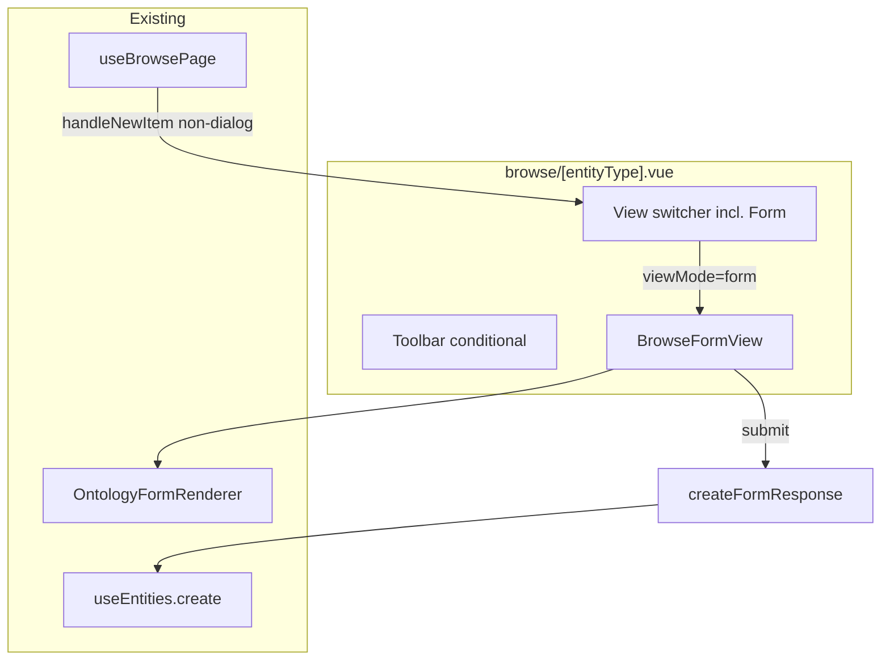

# Spec: Browse Form View — ontology intake on browse pages

**Parent design:** [browse_form_view_design.md](./browse_form_view_design.md)  
**Mock:** [browse_form_view_mockup.html](./browse_form_view_mockup.html)  
**Epic:** forms-browse (Pathway B)  
**Prerequisites (shipped):** `OntologyFormRenderer`, `ontologyToFormSpec`, `formPresentation` on schema  
**Executor lane:** active dev lane  
**Labels:** `needs-e2e`

---

## Problem

Ontology form primitives exist but have no product surface on browse pages. Users can only create records via `+ New` (empty-entity-first + dialog). Survey/stacked/wizard presentations need a dedicated **intake view**; responses should appear in the existing table without a separate entity type or Responses tab.

## Goal

Add **`form`** as a browse view mode on `/workspace/browse/:entityType` for dynamic (user-tier) types. Form view renders `OntologyFormRenderer` in a centered card; submit creates the entity once (submit-then-create). Table/list/grid remain the admin response views.

## Non-goals (v1)

- All-mode browse index (`/workspace/browse`)
- Public `/forms/:slug` route or `formPublish` metadata
- Multiple forms per ontology (form artifact entity)
- Copy link enabled (stub disabled + tooltip only)
- Dirty-form confirm on tab switch
- Presentation picker in Form toolbar (read-only badge only)
- Splitting `+ New` into record vs form dropdown

---

## Architecture



---

## Data model

### Submit payload

`createFormResponse()` builds entity from validated form values:

```ts
{
  type: entityType,
  title: String(values.title ?? '').trim() || 'Untitled',
  ...sanitizedFieldValues,
  submittedVia: 'form',
}
```

- Use `createSmartDefaultItem(type, fields)` as base, merge form values, strip internal keys
- Validate via `validateFormValues(spec, values)` before create
- `submittedVia` is a plain string field on entity data (no ontology migration required)

### Presentation resolution

```ts
function resolveFormLayout(typeConfig: DynamicEntityTypeConfig): FormPresentation {
  const p = typeConfig.formPresentation ?? 'stacked'
  return p === 'entity-dialog' ? 'stacked' : p
}
```

Form view never uses `DialogFormShell` — dialog presentation falls back to stacked inline card.

---

## Browse vocabulary

### 1. Add `form` to `BROWSE_VIEW_MODES`

[`apps/web/app/composables/useBrowse.ts`](../../apps/web/app/composables/useBrowse.ts) — append `'form'` to tuple.

### 2. Projection reconciliation

| File | Change |
|------|--------|
| [`browse-view-mode.ts`](../../apps/web/app/lib/trellis-projection-registry/browse-view-mode.ts) | `form: { type: 'form' }` |
| [`database.ts`](../../apps/web/app/types/database.ts) `ProjectionType` | Add `'form'` |
| [`nodes.ts`](../../apps/web/app/lib/trellis-projection-registry/nodes.ts) | `{ projectionType: 'form', label: 'Form', icon: 'lucide:clipboard-list', order: 12 }` |
| [`projections.ts`](../../apps/web/app/lib/projections.ts) | `defaultBrowseModeLabels`, `defaultBrowseModeIcons`, maps for `form` |
| [`browse-view-mode.test.ts`](../../apps/web/app/lib/trellis-projection-registry/browse-view-mode.test.ts) | Include `form` in exhaustiveness tests |

`form` projection registry node is metadata-only — browse page renders `BrowseFormView` directly (no projection frame component in v1).

### 3. When to show Form tab

Show Form in `viewModeOptions` when:

```ts
typeConfig && 'dynamic' in typeConfig && typeConfig.dynamic === true
```

Hide when `ontologyToFormSpec(schema).fields.length === 0` (no fillable fields after filters).

---

## Components

### `createFormResponse.ts` (new lib)

**Path:** `apps/web/app/lib/createFormResponse.ts`

```ts
export async function createFormResponse(
  entityType: string,
  schema: Pick<OntologySchemaDefinition, '@id' | 'label' | 'fields' | 'formPresentation'>,
  values: Record<string, unknown>,
  createItem: (entity: Entity) => Promise<string>,
): Promise<string>
```

- Build spec via `ontologyToFormSpec(schema, { layout: resolveFormLayout(...), includeTitle: true })`
- Throw or return validation errors if invalid
- Merge `createSmartDefaultItem` + values + `submittedVia: 'form'`
- Call `createItem`, return new id
- Unit test: `createFormResponse.test.ts`

### `BrowseFormView.vue` (new)

**Path:** `apps/web/app/components/browse/BrowseFormView.vue`

| Prop | Type |
|------|------|
| `typeConfig` | `DynamicEntityTypeConfig` |
| `responseCount` | `number` |
| `owners?` | `{ id, name }[]` |

| Emit | Payload |
|------|---------|
| `submitted` | `entityId: string` |
| `view-responses` | — |

**State machine:** `idle` | `success` | `empty`

Composes:
- `FormViewHeader` (inline or colocated)
- `OntologyFormRenderer` with `layout` from `resolveFormLayout`
- `FormSuccessPanel` (inline or colocated)
- Stacked mode: footer **Submit** button (InlineFormShell lacks submit — add in BrowseFormView footer, wire to renderer `handleSubmit` via ref or lifted submit event)

**Empty state:** When spec has zero fields — message + link to schema editor if route exists.

### `FormViewHeader.vue` (new, optional colocate)

- Left: `{responseCount} responses` chip
- Right: presentation badge (capitalized `formPresentation`) + disabled Copy link (`UiTooltip`: "Publishing coming soon")

### `FormSuccessPanel.vue` (new, optional colocate)

- Heading: "Response recorded"
- Buttons: Submit another (reset values to spec.defaults), View responses (emit)

### `OntologyFormRenderer` enhancement (minimal)

For stacked layout inside BrowseFormView, either:

**A (preferred):** Add optional prop `showSubmitFooter?: boolean` on `InlineFormShell` / renderer  
**B:** BrowseFormView renders Submit below renderer and calls exposed `handleSubmit` on renderer ref

Executor picks A or B; behavior must match mock.

### `SurveyFormShell` a11y (if not present)

- `aria-live="polite"` on step label
- `role="progressbar"` on progress track

---

## Page integration

### [`browse/[entityType].vue`](../../apps/web/app/pages/workspace/browse/[entityType].vue)

1. Import `BrowseFormView`
2. Extend `viewModeOptions` with `{ mode: 'form', label: 'Form', icon: 'lucide:clipboard-list' }` when `showFormTab` computed is true
3. Template branch `v-else-if="viewMode === 'form'"` → `<BrowseFormView />`
4. `#toolbarActions`: wrap `+ New` in `v-if="viewMode !== 'form'"`
5. Hide results footer when `viewMode === 'form'`
6. Hide `EntitySelectionBar` when `viewMode === 'form'` (via existing v-if or wrapper)
7. On `@view-responses` from BrowseFormView → `browseState.setViewMode('table')`
8. On `@submitted` → optional toast + increment is automatic via SSE

### `Page.vue` browse chrome (if needed)

If search bar cannot be hidden via page props, add optional `hideSearch?: boolean` when parent passes `browse.viewMode === 'form'`. **Prefer:** parent controls via slot / conditional without Page.vue change if search is already in browseState slot.

---

## `useBrowsePage` changes

**Path:** [`useBrowsePage.ts`](../../apps/web/app/composables/useBrowsePage.ts)

Add optional third parameter or options field:

```ts
formPresentation?: Ref<FormPresentation | undefined>
```

In `handleNewItem`:

```ts
const presentation = formPresentation?.value ?? 'entity-dialog'
if (presentation !== 'entity-dialog') {
  browseState.setViewMode('form')
  return
}
// existing empty-entity-first flow
```

For dynamic types, parent passes `computed(() => typeConfig.value?.formPresentation)`.

### URL deep-link (optional AC)

Support `?view=form` on browse route — on mount, if query present and Form tab visible, `setViewMode('form')`.

---

## Demo / seed

Add or extend a user-tier ontology with `formPresentation: 'survey'` for e2e (e.g. extend playground schema or seed script):

```json
{
  "@id": "trellis:schema/feedback",
  "formPresentation": "survey",
  "fields": [...]
}
```

Document entity type slug in e2e file comment.

---

## Acceptance criteria

### Functional

1. **Form tab visible** on `/workspace/browse/:entityType` for `dynamic: true` types with ≥1 fillable field.
2. **Form tab hidden** for system types without dynamic config (task, note, etc.).
3. **Form view** shows centered card with schema label, `OntologyFormRenderer`, response count header.
4. **Stacked submit** creates entity; does not open dialog; row appears in table view.
5. **Survey/wizard submit** on final step creates entity (submit-then-create, no pre-created empty row).
6. **Success panel** after submit with Submit another + View responses.
7. **View responses** switches to table view.
8. **`+ New` hidden** in form view; visible in table/list/grid.
9. **`handleNewItem`** for `formPresentation: 'survey'|'stacked'|'wizard'` navigates to form view without creating entity.
10. **`handleNewItem`** for `entity-dialog` (or unset) keeps current empty-entity + dialog behavior.
11. **Copy link** disabled with tooltip; no navigation.
12. **Empty schema** shows empty state, not broken renderer.
13. **`submittedVia: 'form'`** stamped on created entities.

### Regression

14. Existing browse views (list, table, grid, graph) unchanged for types without Form tab.
15. `DynamicEntityDialog` create/edit flow unchanged.

### Tests

16. **`bun test`** — `createFormResponse.test.ts`, updated `browse-view-mode.test.ts`.
17. **`bun run check`** (or `pnpm check`) passes.
18. **E2E** `apps/web/tests/e2e/browse-form-view.spec.ts`:
    - Navigate to browse page for seeded feedback type
    - Click Form tab
    - Fill required field(s)
    - Submit
    - Switch to Table tab
    - Assert new row visible with submitted title

### A11y (spot-check)

19. Survey progress has `role="progressbar"`.
20. Success heading receives focus after submit (`tabindex="-1"` + `focus()`).

---

## File touch list

| Action | Path |
|--------|------|
| New | `apps/web/app/lib/createFormResponse.ts` |
| New | `apps/web/app/lib/createFormResponse.test.ts` |
| New | `apps/web/app/components/browse/BrowseFormView.vue` |
| New | `apps/web/app/components/browse/FormViewHeader.vue` (or inline) |
| New | `apps/web/app/components/browse/FormSuccessPanel.vue` (or inline) |
| New | `apps/web/tests/e2e/browse-form-view.spec.ts` |
| Modify | `apps/web/app/composables/useBrowse.ts` |
| Modify | `apps/web/app/composables/useBrowsePage.ts` |
| Modify | `apps/web/app/pages/workspace/browse/[entityType].vue` |
| Modify | `apps/web/app/lib/trellis-projection-registry/browse-view-mode.ts` |
| Modify | `apps/web/app/lib/trellis-projection-registry/nodes.ts` |
| Modify | `apps/web/app/lib/trellis-projection-registry/browse-view-mode.test.ts` |
| Modify | `apps/web/app/types/database.ts` |
| Modify | `apps/web/app/lib/projections.ts` |
| Modify | `apps/web/app/components/forms/ontology/InlineFormShell.vue` or `OntologyFormRenderer.vue` (submit footer) |
| Optional | `apps/web/app/components/forms/ontology/SurveyFormShell.vue` (a11y) |
| Optional | Seed script / demo ontology with `formPresentation` |

---

## Open decisions (defaults for Executor)

| Question | Default |
|----------|---------|
| Form tab position | After Graph in view switcher |
| Stacked submit placement | Footer on BrowseFormView card |
| Toast on submit | Yes — `$toast.success('Response recorded')` |
| `entity-dialog` + New click | Keep dialog flow (no redirect to form) |
| ProjectionType `form` | Add to registry (metadata node); browse renders locally |
| Owners list for people fields | Pass empty array v1; wire later from workspace members |

---

## Deferred (explicit out of scope)

- `formPublish` ontology extension
- Public anonymous form route
- Dirty-form confirm
- All-mode browse Form tab
- Filter table by `submittedVia === 'form'`
