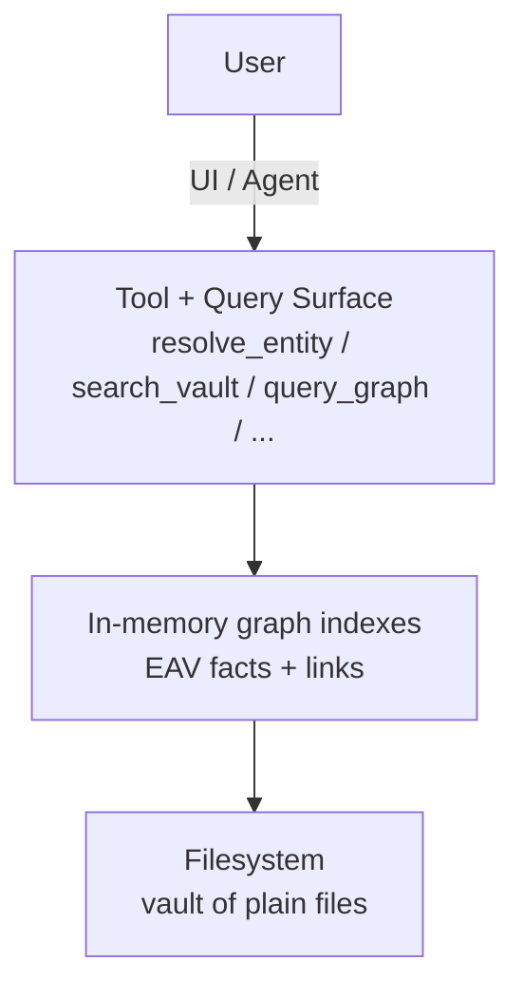

# 3. Architecture

## 3.1 System overview

Filegraph is built around a simple idea: treat the filesystem as the source of truth, and treat a graph as an index over that filesystem.

Another way to read the architecture is through three modes of interaction with the same underlying graph:

- **World**: the user-facing surface (files, entities, queries, and the agent).
- **Forge**: the modeling surface (ontology, schemas, and publishing rules that shape what the system can say).
- **Observatory**: the trust surface (provenance, epochs, audits, and review workflows that help you decide what to believe).

At a high level:



This section describes:

- How the vault is represented as files.
- How those files become a graph (facts + links).
- How the runtime stays up-to-date as the filesystem changes.
- How the AI agent queries the graph in a way that is inspectable.

## 3.2 Vault as files (persistence layer)

Filegraph stores user data in an “opinionated vault” directory (default `~/.filegraph`). The vault is just a folder; backing it up is copying the folder.

The vault contains a small number of top-level namespaces, represented as folders prefixed with `@`:

- `@entities/` — structured entities (people, projects, tasks, organizations, …)
- `@notes/` — rich text notes (`.note` files)
- `@system/` — derived data and system state
- Additional namespaces (e.g., `@calendar/`, `@email/`, `@finance/`) as the system grows

 <!-- FIGURE IDEA: Screenshot of a real vault directory tree (Finder/terminal) showing `@entities/`, `@notes/`, `@system/`, and an example `.data` + `.note` file. -->

Two file formats matter most:

- **`.data`** — structured entity collections (JSON / JSON-LD shaped)
- **`.note`** — rich-text notes stored as JSON (TipTap block structure)

Filegraph also writes graph materializations alongside content:

- **`_graph_.data`** — per-namespace graph snapshots
- **`@system/_graph_.data`** — a global federated graph that references all namespace graphs

These `_graph_.data` files are not the source of truth. They are derived artifacts that can be regenerated.

## 3.3 Graph model: EAV facts + links

Internally, Filegraph maintains an in-memory **EAV store** (Entity–Attribute–Value) plus a link index.

A **fact** is an attribute-value pair attached to an entity:

```ts
{ e: "file:…", a: "name", v: "README.md" }
{ e: "file:…", a: "modified", v: 1734834123456 }
```

A **link** is a directed edge between two entities:

```ts
{ e1: "file:parent", a: "fs:contains", e2: "file:child" }
```

Today, the canonical links are filesystem-level containment links (`fs:contains`). Additional links are layered on top:

- **Reference links** parsed from file contents (entity references, note references)
- **Metadata links** that attach derived metadata objects to files (e.g., image captions)

 <!-- TABLE IDEA: A compact table mapping “edge class” → examples → how it is derived (filesystem event vs parser vs AI synthesis). -->

### Stable identity

File and folder entities are assigned stable IDs (e.g., `file:<uuid>`) and the path↔id mapping is persisted across restarts.

Domain entities (people, projects, tasks, etc.) use human-readable IDs (e.g., `person:sarah:001`, `proj:website-redesign:001`) stored in `.data` files.

This “two identity systems” approach is intentional:

- Files need stable IDs across renames/moves.
- Human entities need inspectable, readable IDs.

## 3.4 Indexing pipeline

Filegraph keeps its in-memory graph in sync with the filesystem using two complementary indexers.

### 3.4.1 Filesystem index (TQL runtime)

The TQL runtime performs an initial scan of the vault, then incrementally applies filesystem changes.

During ingestion it:

- Walks the directory tree.
- Creates an entity ID for each file/folder.
- Adds file facts (path, name, size, created, modified, extension, hidden).
- Adds containment links (`fs:contains`) based on parent/child relationships.

After the scan (and after bursts of filesystem changes), the runtime generates and persists federated graphs:

- One `_graph_.data` per namespace folder.
- A global `@system/_graph_.data` that references all per-namespace graphs.

This enables:

- Fast graph visualization without re-querying the whole world.
- A clear separation between source data (files) and derived artifacts (graphs).

### 3.4.2 Reference index (universal linking)

In addition to file containment, Filegraph builds a reference index by parsing supported file types for references.

This powers backlink-style workflows:

- “Where is `proj:website-redesign:001` mentioned?”
- “Which notes link to `person:sarah:001`?”

## 3.5 Query surface

At the time of writing, Filegraph exposes a pragmatic query surface oriented around EAV primitives.

### 3.5.1 EAV operations (used by the agent)

The primary graph query tool is `query_graph`, which supports:

- `get_facts` — all facts for an entity
- `get_links` — all links involving an entity
- `get_backlinks` — all links where the entity is the target
- `get_outgoing` — all links where the entity is the source
- `find_by_attribute` — filter entities by an attribute (optionally by namespace)
- `aggregate` — sum/count/avg/min/max over numeric attributes (with filters)

This is intentionally small. It’s powerful enough to express most “knowledge OS” questions as a few composable steps.

 <!-- FIGURE IDEA: Screenshot of the agent tool trace UI showing a `resolve_entity` call followed by `query_graph`, with expandable JSON arguments/results. -->

### 3.5.2 Human-facing query language (in progress)

You’ll see references to “TQL” as a human-facing query language in the UI (e.g., preset queries like `file.modified > now() - 7d`). The indexing/runtime pieces are real and heavily used; the full query parser/evaluator is still being developed.

The important architectural point is the separation:

- **Indexing is stable and incremental**.
- **Query UX can evolve** without changing the underlying persistence model.

## 3.6 The AI agent (inspectable reasoning)

Filegraph integrates an AI agent as a first-class interface to the vault.

The agent does not “answer from vibes.” Instead, it issues tool calls that read from and compute over the vault.

Two aspects make this inspectable:

- **Every tool call is explicit** (name + arguments).
- **Every tool result is structured data** that can be shown to the user and debugged.

### 3.6.1 Walkthrough: project team lookup

User question:

> Who is on the Website Redesign Project team?

Step 1 — resolve the project ID:

```json
resolve_entity({ "name": "Website Redesign Project", "namespace": "proj" })
```

Example result shape:

```json
{
  "resolved": true,
  "entityId": "proj:website-redesign:001",
  "name": "Website Redesign Project",
  "namespace": "proj",
  "entity": {
    "id": "proj:website-redesign:001",
    "team": ["person:marcus:001", "person:emma:001"],
    "lead": "person:sarah:001"
  },
  "alternates": []
}
```

Step 2 — fetch each team member:

```json
get_entity({ "entityId": "person:marcus:001" })
get_entity({ "entityId": "person:emma:001" })
```

The assistant response is then constructed from the returned entities:

- Marcus Rodriguez (Lead Developer)
- Emma Thompson (UI/UX Designer)

Crucially: if the answer is wrong, you can inspect which tool returned the wrong fact.

### 3.6.2 Walkthrough: attribute query (tasks by assignee)

User question:

> What tasks is Marcus assigned to?

A minimal tool plan:

1. `resolve_entity({ name: "Marcus", namespace: "person" })` → `person:marcus:001`
2. `query_graph({ operation: "find_by_attribute", attribute: "assignee", value: "person:marcus:001", namespace: "task" })`

That second step returns a structured list of matching tasks, which the assistant formats into a human answer.

## 3.7 Current limitations (and why they matter)

A few architectural edges are intentionally left rough in the prototype:

- **Permissions**: the system can show backlinks and traversals, but fine-grained graph ACLs are not yet a solved problem.
- **Ontology evolution**: schemas change; query surfaces must tolerate evolution.
- **Multiple query layers**: filesystem graphs, entity graphs, and derived AI metadata graphs are not fully unified yet.

These are not footnotes—they shape what “Turtlestack” could become in later iterations. Section 7 explores how these limitations inform Turtlestack, a platform extraction of Filegraph's architecture.

 <!-- TABLE IDEA: “Current limitations” matrix (capability, why it matters, prototype status, path to solution). Useful as a scannable visual in a long-form post. -->

_Next: Section 4 - Ontology Design_
