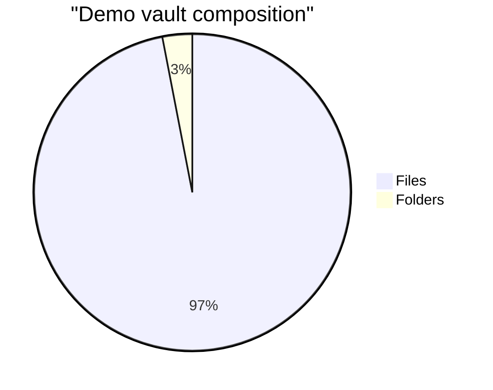

# 5. Implementation

This section describes the concrete implementation of Filegraph as it exists today: a Tauri desktop app with a TypeScript runtime that indexes a vault directory into an in-memory EAV store, persists derived graph artifacts back into the vault, and exposes that structure through UI and an inspectable tool-using agent.

## 5.1 Technology stack

Filegraph is implemented as a local-first desktop application.

From a user perspective, the implementation surfaces three modes that are all projections over the same runtime (not separate applications): **World** (browse files/entities and ask questions), **Forge** (configure schemas/publishing rules), and **Observatory** (inspect provenance and system health).

- **Shell (desktop runtime)**: Tauri 2 (Rust host + web UI)
- **Frontend**: React + TypeScript, built with Vite
- **Graph/runtime core (today)**: a TypeScript “TQL runtime” built around an in-memory EAV store
- **Filesystem integration**: Rust-side Tauri commands for directory listing, reading/writing files, and filesystem watching
- **Agent model providers**: a multi-provider adapter layer supporting local and hosted models (Ollama, OpenAI, Anthropic, Groq, Gemini)

<!-- FIGURE IDEA: Screenshot of the running desktop app (sidebar + main view) to ground readers who aren’t familiar with the UI. -->

A key point for readers: some parts of the stack are deliberately _aspirational_ in the north-star architecture (e.g., a Rust/WASM graph engine and more sophisticated incremental query evaluation). The prototype described here is the system that is implemented and used.

## 5.2 Key design decisions

### 5.2.1 Why Tauri

Tauri provides a pragmatic middle ground for a local-first product:

- **Native filesystem access** without shipping a full Chromium bundle.
- **A web UI** with familiar tooling (React/Vite) rather than a bespoke native UI stack.
- **A clear boundary** between “trusted host” (Rust commands that touch disk/network) and the TypeScript UI/runtime.

### 5.2.2 Why an in-memory EAV store (for the prototype)

The current implementation uses an in-memory EAV store (`src/lib/tql/eav-store.ts`) as the simplest substrate that can support:

- Facts like `(fileId, name, "README.md")`
- Links like `(folderId, fs:contains, fileId)`

This is intentionally simple and inspectable:

- Facts are `[{ e, a, v }]`.
- Links are `[{ e1, a, e2 }]`.

The tradeoff is obvious: without indexes beyond in-memory maps, more complex query planning and large-scale performance are future work.

### 5.2.3 Why stable file IDs

Filesystem paths are not stable identifiers. Renames and moves are normal.

The prototype solves this by assigning **stable IDs to file/folder entities** using `EntityIdManager` (`src/lib/tql/entity-ids.ts`):

- First time a path is seen, assign `file:<uuid>`.
- Persist the mapping to the app data directory (`tql-indexes.json`).
- On rename/move events, update the mapping without changing the ID.

This gives the graph a stable substrate even as the vault evolves.

### 5.2.4 Why derived graph artifacts live in the vault

In addition to the EAV runtime, Filegraph writes derived artifacts back into the vault:

- Per-namespace `@*/_graph_.data`
- Global `@system/_graph_.data`

These files are derived, not canonical. The implementation makes that explicit:

- The TQL runtime can regenerate them.
- It avoids feedback loops by treating `_graph_.data` as graph artifacts (writes shouldn’t trigger self-reindexing).

In code, this is implemented in `TQLRuntime.persistFederatedGraphs()` (`src/lib/tql/runtime.ts`) backed by:

- `FederatedGraphBuilder` and `GlobalGraphAggregator` (`src/lib/tql/global-graph.ts`)

### 5.2.5 Why multi-provider LLM adapters

The agent is designed to work across local and hosted models.

The implementation exposes a unified provider abstraction (`src/lib/providers/`) with:

- A **registry** of providers and model presets.
- A single adapter interface for `chat()` and `chatStream()`.

This allows the system to:

- Use hosted models (Gemini/OpenAI/etc.) when configured.
- Use local models (Ollama) for privacy, cost, and offline operation.

## 5.3 What worked

### 5.3.1 Indexing a vault into stable primitives

The filesystem-to-facts pipeline is straightforward and reliable:

- `TQLRuntime.initialScan(rootPath)` walks the vault via a Rust-side `list_directory` command.
- Each file/folder becomes a stable entity ID.
- Each entity accumulates a small set of facts (type, path, name, timestamps, etc.).
- Parent/child relationships become `fs:contains` links.

Because these facts are minimal and stable, many UI features become “views over the graph” rather than bespoke state.

### 5.3.2 Incremental update handling

The prototype uses a debounced queue to coalesce rapid filesystem changes:

- `FSWatcherQueue` (`src/lib/tql/watcher-queue.ts`) merges events by path and heuristically detects renames.
- The runtime applies batches rather than reacting to every event individually.

This provides a good baseline user experience for real-world change patterns (rapid edits, bulk renames, git operations).

### 5.3.3 Graph federation as a practical UX shortcut

Persisting `_graph_.data` files turned out to be a pragmatic bridge between “fully query everything” and “make the UI fast and inspectable.”

The global graph aggregator also records summary stats (node/edge counts, breakdowns), which is useful both for UI and for debugging.

### 5.3.4 Inspectable agent integration

The agent is wired through explicit tool calls rather than implicit internal magic.

The core implementation lives in:

- `src/features/agent/tools/index.ts` (tool definitions + execution)
- `src/features/agent/hooks/useModelProvider.ts` (tool-call loop + provider integration)

This makes it possible to inspect:

- which tool was called,
- with what arguments,
- and what structured result came back.

For example, a question like “What files reference `proj:website-redesign:001`?” can be decomposed into a graph query (using EAV primitives):

```json
query_graph({ "operation": "get_backlinks", "entityId": "proj:website-redesign:001", "attribute": null, "value": null, "namespace": null, "aggregation": null, "filters": null, "limit": 20 })
```

Example result shape (as returned by the tool):

```json
{
  "entityId": "proj:website-redesign:001",
  "backlinkCount": 2,
  "backlinks": [
    { "sourceId": "file:<uuid>", "relationship": "ref:mentions" },
    { "sourceId": "task:<slug>:<index>", "relationship": "data:references" }
  ]
}
```

The assistant then turns that structured data into a human answer, but the underlying evidence remains visible.

<!-- FIGURE IDEA: Screenshot of the tool-call inspector / evidence panel showing a real query and the expandable JSON result. -->

## 5.4 What was hard

### 5.4.1 Keeping the “paper architecture” honest

A recurring constraint in the implementation is avoiding “architecture fiction.” The prototype has a real indexing runtime and graph artifacts, but it does not yet have:

- a fully-fledged human-facing query language,
- sophisticated query optimization,
- statement-level provenance for every derived fact,
- or a unified semantic graph that fully merges entity graphs and filesystem graphs.

Being precise about what exists (and what is planned) is itself part of the engineering work.

### 5.4.2 Avoiding feedback loops

Writing derived artifacts back into the vault is powerful, but it risks creating “indexing eats its own tail” loops.

The runtime explicitly treats `*_graph_.data` as artifacts and skips them during certain update paths.

### 5.4.3 Linking across heterogeneous file types

The vault contains multiple “kinds” of content:

- Structured `.data` collections
- Prose notes (e.g., `.note`, `.md`)
- Binary media (images, PDFs)

A universal linking system requires:

- consistent reference parsing,
- stable ID resolution,
- and good UX for navigation.

The prototype has the core parsing and resolution primitives (see the link parser and resolver modules), but the UX and authoring tools are still evolving.

## 5.5 Performance characteristics (prototype)

The runtime logs ingestion duration and files/sec during the initial scan.

For this paper, we treat performance numbers as _measured claims_ that must be verified before publication:

- **Indexing throughput**: [TODO: measure on M1 Mac for a representative vault]
- **Incremental update latency**: [TODO: measure file save → graph update]
- **Memory footprint**: [TODO: measure store stats + process RSS for N files]
- **Cold start time**: [TODO: measure launch → usable UI with existing indexes]

To make these measurements repeatable, the repository includes a simple Node-based benchmark harness:

- `pnpm bench:tql` (runs `scripts/bench-tql.ts`)
- Optional JSON output: `pnpm -s bench:tql --json bench.json`
- Optional Mermaid snippet generation: `pnpm -s bench:mermaid --in bench.json --out bench-snippet.md`

### Benchmark snapshot (demo vault)

As a sanity check, we ran the benchmark against the small demo vault (`src/data/demo-files`). This is not intended to represent a real user vault; it exists to validate the instrumentation pipeline and give order-of-magnitude baselines:

A more realistic next validation target would be a personal vault on the order of ~10k files and ~50k derived facts, where incremental updates, query latency, and memory footprint become the dominant constraints.

<!-- TABLE IDEA: Benchmark summary table (vault size, scan ms, entities/sec, RSS, heapUsed) with multiple runs (min/avg/max) for credibility. -->
<!-- FIGURE IDEA: Screenshot of the terminal output from `pnpm bench:tql` (or a small plotted chart) for a “proof it ran” artifact. -->

Note: these numbers vary across machines and even across repeated runs (filesystem cache + JS JIT effects). The point is not the exact value, but that the measurements are reproducible and can be regenerated.

- **Entities**: 428 (files=415, folders=13)
- **Scan time (example run)**: 11.48ms
- **Throughput (example run)**: 37,268 entities/sec
- **Memory (RSS after, example run)**: 73.11 MB (heapUsed=8.41 MB)

```mermaid
flowchart LR
  V[Vault: src/data/demo-files\nfiles=415\nfolders=13] --> S[Scan → EAV build\n11.48ms\n37,268 entities/sec]
  S --> M[Process memory (after)\nRSS=73.11MB\nheapUsed=8.41MB]
```



## 5.6 What we would build differently

The prototype is intentionally minimal so we could validate the core loop (files → graph → inspectable navigation). If we were rebuilding for scale and long-term maintainability, the biggest changes would be:

- **A Rust/WASM graph engine instead of a TypeScript EAV store**: the current store is inspectable and fast enough for early vaults, but it is not the right long-term substrate for large graphs.
- **Statement-level provenance from day one**: many of the “trust surface” questions only become answerable when every derived fact can be traced to a source, timestamp, and derivation step.
- **A unified entity + filesystem graph**: the prototype intentionally keeps multiple layers (filesystem containment, entity collections, derived metadata) somewhat distinct; a mature system should make cross-layer traversal first-class.
- **Real query planning infrastructure**: the agent can get far with a small set of EAV operations, but a human-facing query language (and performance at scale) requires indexes, compilation/planning, and incremental evaluation.

---

## References (placeholder)

- Tauri documentation. [TODO]
- Vite and React documentation. [TODO]
